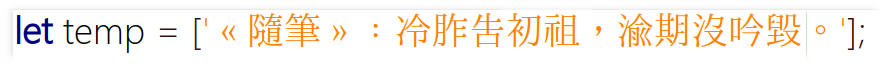

# 字體个性化腳本

請先安裝 nodejs

推薦﹕

I.Ming ( I.明體 / 一点明朝体 / 一點明體 ) https://github.com/ichitenfont/I.Ming

花園字體 http://fonts.jp/hanazono/  ( 用以補充缺字 ) 

開心宋體 ( 請自行上網搜索下載 ) ( 用以補充缺字以及選用其中的標點符號 ) 

並用纖細的黑體的 ( 請自行選擇 ) 半角字母數字符號替代一點明體中的相應字符﹐以達到我認爲較好的中英文混排效果。

我之所以以一點明體爲基準﹐因爲我希望﹕

「礻」旁是「示」旁﹐遵從小篆的形﹐並與「衤」有較大區別﹔

「令」部的最後那个點是豎筆﹐遵從小篆的形﹐並與「今」有較大區別﹔

「丸丮」的演化有區別﹕「丸」作「橫曲鈎（橫折彎鈎）」﹐「點」筆內藏﹐而「丮」作「橫捺鈎（橫斜鈎）」﹐而「點」筆破撇出頭﹔

「月肉舟」的演化有區別﹕「月」部中的橫不觸及右邊竪綫﹐「肉」部中的橫觸及右邊竪綫﹐「舟」部在「兪」等字中化爲似「月」部﹐使用「冂」內兩个斜點以區別﹔

「告吿」牛旁在上方時﹐豎筆無需截斷保留最少的形變﹐也方便計算機自動構字﹔

另有一些構形意見﹕

「鬼魁……」﹕鬼旁的右下部無需延長﹐只如小篆般作爲左右結構的左部卽可。方便計算機自動構字。

效果圖﹕

